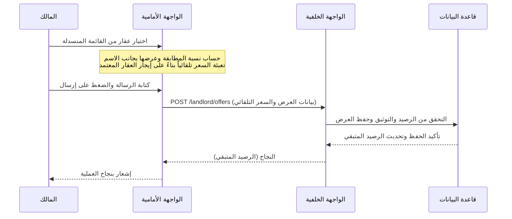
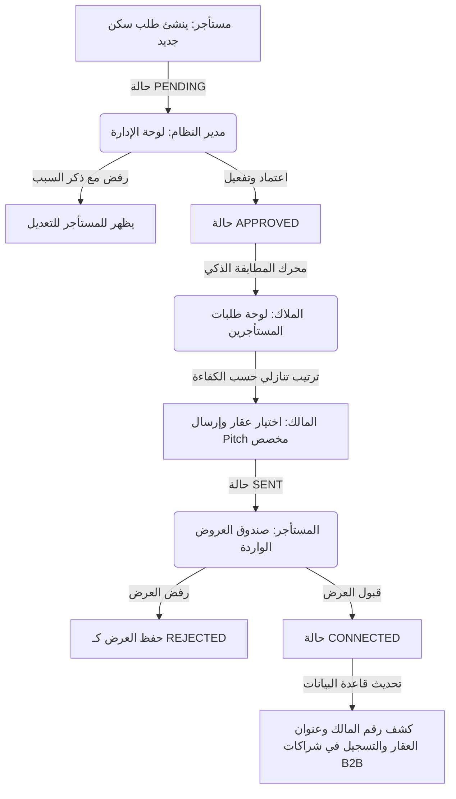

# دليل ميزات مشروع PropMatch AI (شامل ومفصّل)

يركز هذا الدليل على تقديم تحليل شامل ومفصل لكافة ميزات مشروع **PropMatch AI**، مع شرح بنية التنفيذ التقنية لكلا الجانبين: الواجهة الخلفية (Backend) والواجهة الأمامية (Frontend)، متضمنة مسارات البيانات ونظم الصلاحيات.

---

## 📌 جدول المحتويات
1. [نظرة عامة على النظام وأدوار المستخدمين](#1-نظرة-عامة-على-النظام-وأدوار-المستخدمين)
2. [مصفوفة الميزات التفصيلية وآلية التنفيذ](#2-مصفوفة-الميزات-التفصيلية-وآلية-التنفيذ)
   - [أولاً: نظام الهوية والتوثيق والتحقق من الشخصية (eKYC)](#أولا-نظام-الهوية-والتوثيق-والتحقق-من-الشخصية-ekyc)
   - [ثانياً: لوحة تحكم المالك وإدارة العقارات](#ثانيا-لوحة-تحكم-المالك-وإدارة-العقارات)
   - [ثالثاً: لوحة تحكم المستأجر ونشر طلبات السكن](#ثالثا-لوحة-تحكم-المستأجر-ونشر-طلبات-السكن)
   - [رابعاً: السوق العكسي للمطابقة الذكية وإرسال العروض](#رابعا-السوق-العكسي-للمطابقة-الذكية-وإرسال-العروض)
   - [خامساً: نظام المراجعة والتقييمات الخاضعة للإشراف](#خامسا-نظام-المراجعة-والتقييمات-الخاضعة-للإشراف)
   - [سادساً: لوحة تحكم الإدارة (Admin Panel) وإدارة الصفوف](#سادسا-لوحة-تحكم-الإدارة-admin-panel-وإدارة-الصفوف)
   - [سابعاً: نظام الدفع والاشتراكات وشراكات B2B](#سابعا-نظام-الدفع-والاشتراكات-وشراكات-b2b)
3. [المخططات البنيوية ومسارات البيانات (Mermaid Diagrams)](#3-المخططات-البنيوية-ومسارات-البيانات)
4. [محددات الأمان وخصوصية البيانات (PII)](#4-محددات-الأمان-وخصوصية-البيانات)

---

## 1. نظرة عامة على النظام وأدوار المستخدمين

يعتمد مشروع **PropMatch AI** على فكرة **السوق العقاري العكسي (Reverse Marketplace)**؛ حيث يقوم المستأجر بنشر متمتطلبات سكنه بدلاً من البحث التقليدي، بينما يقوم الملاك الموثقون بتقديم عروض مخصصة بناءً على مطابقة ذكية.

يحتوي النظام على ثلاثة أدوار أساسية:
*   **المستأجر (Tenant):** يسجل ويبحث مجاناً، ينشر طلبات سكن تفصيلية، يستقبل عروض الملاك ويقبلها أو يرفضها، ويقيم العقارات.
*   **المالك (Landlord):** ينشر العقارات، ويشترك في باقات الإعلانات وعروض الملاك (Offer Packs)، ويبحث في طلبات المستأجرين ويرسل عروضاً مخصصة.
*   **المدير (Admin):** يتحقق من وثائق المستخدمين (eKYC)، يراجع العقارات الجديدة، يعتمد طلبات السكن، ويشرف على التقييمات قبل نشرها للعامة.

---

## 2. مصفوفة الميزات التفصيلية وآلية التنفيذ

### أولاً: نظام الهوية والتوثيق والتحقق من الشخصية (eKYC)

> [!IMPORTANT]
> التوثيق مطلوب مرة واحدة وهو شرط أساسي للقيام بالعمليات الحيوية مثل قبول العروض، نشر الإعلانات، أو كشف بيانات الاتصال.

*   **وصف الميزة:** يقوم المستخدم برفع الوجه الأمامي والخلفي للرقم القومي مع صورة شخصية (Selfie).
*   **آلية التنفيذ الخلفية (Backend):**
    *   يتم حفظ البيانات في جدول `IDENTITY_VERIFICATION` المرتبط بـ `User` بنسبة 1:1.
    *   الحالات المدعومة في الـ Enum: `NOT_SUBMITTED`, `PENDING`, `APPROVED`, `REJECTED`.
    *   عند الرفض، يتم تخزين سبب الرفض في حقل `rejection_reason` لتمكين المستخدم من التعديل وإعادة التقديم.
*   **آلية التنفيذ الأمامية (Frontend):**
    *   صفحة المراجعة المشتركة الموحدة والحيادية للأدوار: `/verify` التي تستدعي مكون [KycWizard.tsx](file:///home/waleed/projects/propmatch/propmatch-frontend/src/features/ekyc/components/KycWizard.tsx).
    *   يتتبع حالة التوثيق ديناميكياً ويوجه المستخدم تلقائياً بعد انتهاء العملية إلى لوحة التحكم الخاصة بدوره الفعلي (`/tenant` أو `/landlord` أو `/admin`) بناءً على البيانات المسترجعة من خطاف `useSession`.

---

### ثانياً: لوحة تحكم المالك وإدارة العقارات

*   **وصف الميزة:** تتيح للملاك إدخال بيانات العقارات وتتبع حالة قبولها من الإدارة.
*   **آلية التنفيذ الخلفية (Backend):**
    *   تخزين تفاصيل العقار في جدول `PROPERTY` شاملة الأسعار، عدد الغرف، البيانات الجغرافية العامة (المحافظة/المدينة/الحي)، وتفاصيل الخدمات المحيطة بالأماكن.
    *   إدارة الصور عبر جدول `PROPERTY_IMAGE` مع تحديد الترتيب (`display_order`) وتعيين صورة الغلاف الرئيسية (`is_cover`).
    *   حجب العنوان الدقيق (`manual_address`) وهاتف المالك في الاستعلامات العامة.
*   **آلية التنفيذ الأمامية (Frontend):**
    *   المسارات: `/landlord` لعرض العقارات الحالية، و`/landlord/properties/new` لإضافة عقار جديد عبر معالج إدخال مقسم لخطوات (Multi-step Wizard).
    *   الاتصال بالخلفية عبر خطافات `useMyProperties` و`useCreateProperty`.

---

### ثالثاً: لوحة تحكم المستأجر ونشر طلبات السكن

*   **وصف الميزة:** تتيح للمستأجر كتابة متطلباته السكنية بالتفصيل ليتولى محرك الذكاء الاصطناعي مطابقتها.
*   **آلية التنفيذ الخلفية (Backend):**
    *   تخزين الطلبات في جدول `TENANT_REQUEST` بربط 1:N مع المستخدم.
    *   تتضمن الحقول: الميزانية الدنيا والقصوى، نوع العقار (`APARTMENT`, `VILLA`, `STUDIO`)، ومستوى المرونة (`flexibility_score` من 1 إلى 10) والوصف النصي الحر للمطابقة الذكية (`lifestyle_requirements`).
*   **آلية التنفيذ الأمامية (Frontend):**
    *   المسارات: `/tenant/requests` لاستعراض طلباتي الحالية وعدد العروض المقدمة لكل منها، و`/tenant/requests/new` لإنشاء طلب سكن جديد.

---

### رابعاً: السوق العكسي للمطابقة الذكية وإرسال العروض

*   **وصف الميزة:** يرى المالك طلبات المستأجرين مرتبة تنازلياً حسب نسبة مطابقتها لعقاراته المعتمدة، ويقوم بإرسال عرض Pitch مخصص للمستأجر.
*   **آلية التنفيذ الخلفية (Backend):**
    *   الاستعلام الموجه للمالك `GET /landlord/requests` يقوم بحساب المطابقة عبر دالة `scoreRequestAgainstProperty` التي تدمج معايير الميزانية، الموقع، النمط، وتداخل نصوص الوصف.
    *   تقديم العروض يحفظ في جدول `OWNER_OFFER`.
*   **آلية التنفيذ الأمامية (Frontend):**
    *   المسار: `/landlord/requests` لاستعراض طلبات السكن.
    *   **عرض نسبة المطابقة ديناميكياً:** تظهر نسبة المطابقة بجانب كل عقار للمالك في القائمة المنسدلة داخل المكون [SendOfferSheet.tsx](file:///home/waleed/projects/propmatch/propmatch-frontend/src/features/matching/components/SendOfferSheet.tsx).
    *   **التسعير التلقائي:** تم إلغاء حقل السعر اليدوي؛ حيث يتم قراءة وتعيين السعر تلقائياً بناءً على القيمة الإيجارية للعقار المختار فور تحديده.

---

### خامساً: نظام المراجعة والتقييمات الخاضعة للإشراف

*   **وصف الميزة:** يمكن للمستأجر كتابة تقييمات للعقارات، وتمر هذه التقييمات عبر مرحلة إشراف إداري قبل النشر للعامة لمنع الرسائل غير المرغوبة.
*   **آلية التنفيذ الخلفية (Backend):**
    *   جدول `PROPERTY_REVIEW` يحتوي على الحقول: `rating` (من 1 إلى 5)، `comment` (نص التقييم)، والحالة `status` (`PENDING`, `APPROVED`, `REJECTED`).
    *   استعلام تقييمات العقار العام لا يرجع سوى الصفوف ذات الحالة `APPROVED`.
*   **آلية التنفيذ الأمامية (Frontend):**
    *   يقوم المستأجر بتقديم تقييم عبر المكون المخصص في صفحة تفاصيل العقار `/tenant/properties/[id]`.
    *   يدخل التقييم تلقائياً بحالة `PENDING` ويذهب فوراً لصف الإشراف الإداري.

---

### سادساً: لوحة تحكم الإدارة (Admin Panel) وإدارة الصفوف

*   **وصف الميزة:** واجهة موحدة لمديري النظام لمراجعة واعتماد وتوثيق الأنشطة الأربعة المعلقة.
*   **آلية التنفيذ الخلفية (Backend):**
    *   نقطة النهاية `GET /admin/queues` تجمع الطلبات المعلقة من جداول (التوثيق، العقارات، طلبات السكن، والتقييمات).
    *   نقاط اتخاذ القرار `POST /admin/.../review` تستقبل قرار المدير (`approve` أو `reject`) مع سبب الرفض الإلزامي.
*   **آلية التنفيذ الأمامية (Frontend):**
    *   المسار: `/admin` ويعرض لوحة متكاملة مقسمة لـ 4 أعمدة في [AdminDashboard.tsx](file:///home/waleed/projects/propmatch/propmatch-frontend/src/features/admin/components/AdminDashboard.tsx):
        1. **العقارات المعلقة:** يوجه المدير لصفحة فحص تفاصيل العقار لاعتماده.
        2. **طلبات التوثيق:** يوجه المدير لصفحة فحص مستندات الرقم القومي والصورة الشخصية للمطابقة.
        3. **طلبات السكن المعلقة:** يتم قبولها أو رفضها مع كتابة السبب **مباشرة ودفعة واحدة داخل اللوحة (Inline Actions)**.
        4. **التقييمات المعلقة:** يتم اعتمادها أو رفضها وإزالتها من الصف **مباشرة (Inline Actions)** مع إشعار فوري للمستأجر بنتيجة الإشراف.

---

### سابعاً: نظام الدفع والاشتراكات وشراكات B2B

*   **وصف الميزة:** تحقيق إيرادات المنصة من خلال بيع الميزات الإضافية وباقات الملاك مع شراكات توفير الخدمات (مثل الأثاث أو التأمين).
*   **آلية التنفيذ الخلفية (Backend):**
    *   تخزين العمليات في جداول `USER_QUOTA` لحساب الرصيد الحالي للملاك (عدد العروض المتاحة، تميز الإعلانات).
    *   عند استهلاك العروض المجانية، يتم توجيه المستخدم لدفع قيمة إضافية بالربط مع بوابة Paymob وتحديث الكوتا فور وصول إشعار الاستدعاء (Webhook) بنجاح العملية.
    *   شراكات B2B: عند قبول العرض وتأسيس الاتصال، يُعرض على المستأجر خيار إرسال تفاصيله لشركاء الخدمات (تخزن كـ `PartnerLead` في قاعدة البيانات).
*   **آلية التنفيذ الأمامية (Frontend):**
    *   مكون [PaymentSheet.tsx](file:///home/waleed/projects/propmatch/propmatch-frontend/src/features/payments/PaymentSheet.tsx) يظهر تلقائياً كشاشة منبثقة (Modal) لحظر العمليات فور استقبال خطأ كوتا من الخادم ويسمح باختيار الباقة والشراء الفوري.

---

## 3. المخططات البنيوية ومسارات البيانات

يوضح المخطط التالي دورة حياة **طلب السكن للمستأجر** بدءاً من إنشائه مروراً باعتماده إدارياً، ثم مطابقتة للملاك، وتقديم عرض وقبوله لكشف البيانات:

---

## 4. محددات الأمان وخصوصية البيانات (PII)

> [!CAUTION]
> الحفاظ على سرية الهوية والبيانات الشخصية هو الركيزة الأساسية لأمان المنصة ويتم فرضها بصرامة على مستوى الخادم وليس الواجهة.

1.  **حجب البيانات الشخصية:** لا تظهر أسماء المستأجرين، بريدهم الإلكتروني، أو أرقام هواتفهم للملاك في أي مرحلة من تصفح طلبات السكن المعروضة.
2.  **كشف البيانات بعد القبول:** يتم فقط كشف بيانات الاتصال (مثل رقم هاتف المالك والعنوان الكامل للعقار المعني) للمستأجر **حصرياً** وفقط بعد نقره الفعلي على "قبول العرض" وتحول حالة المطابقة إلى `CONNECTED`.
3.  **إخلاء المسؤولية عن الملكية:** يُعرض المكون `<OwnershipDisclaimer />` بشكل مستمر في واجهات التحقق للتأكيد للمستخدمين على أن التوثيق يؤكد هوية الشخص الشخصية ولا يثبت ملكيته العقارية الفعلية، حماية من الاحتيال العقاري.
4.  **منع التمرير السهل للبيانات:** جميع الوثائق المرفوعة لغرض التحقق (eKYC) يتم جلبها عبر روابط مؤقتة مشفرة وصالحة لفترات قصيرة جداً، ولا يتم معالجتها أو تمريرها مطلقاً لأي أطراف خارجية أو نماذج لغوية عامة.
